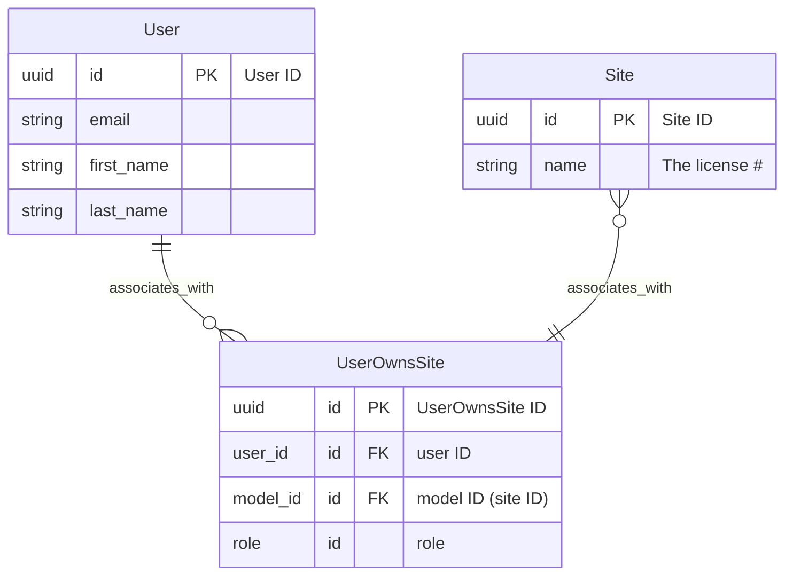
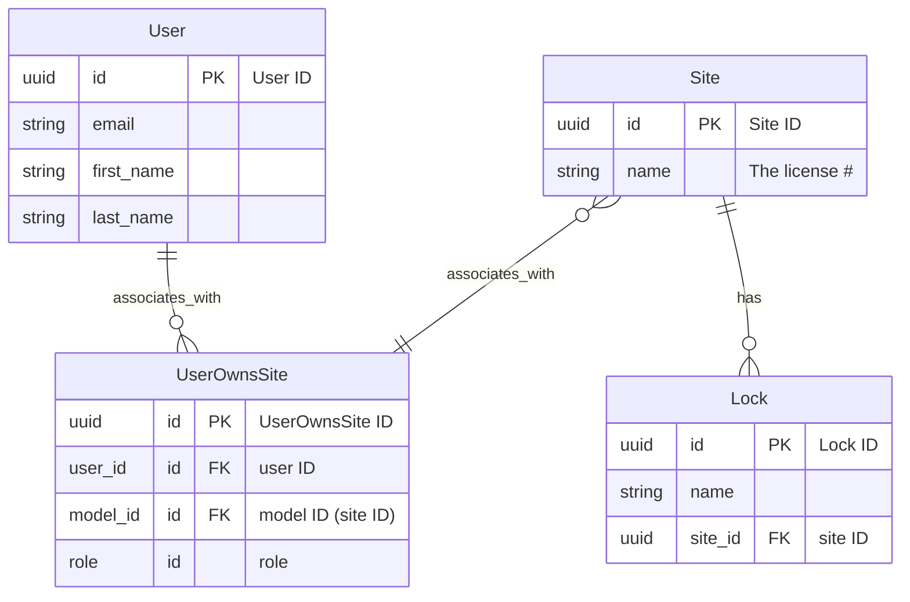

# BetterREST

This experimental project aims to allow user to define only database schema to have
the basic CRUD functionality provided by a REST interface.

# Using BetterREST

[TOC]

## The Type of relations

1. ###### Ownership model, where it's directly under user access
   
   The model Site is an ownership-based model in the ER diagram below. Site and User has a many-to-many relationship. Currently we don't have support user who directly owns a model.


2. Link table. This is the UserOwnsSite table from above. There is a mapper for this which allows this also to be made as a REST endpoint which allow users to edit the association for the user and the model. In the case above, we have a "role", which serves as the role for the user. Currently there is just an admin role (0) or a guest role (1). Admin role has a full power. Guest role is user only.

2. Under-org model, where it's indirectly under another model which is an ownership-based object.

   An example is the Lock in the ER diagram. It is and can only be indirectly associated with the user via an ownership model such as Site. The model therefore has a site_id.




4. Global model. This is public and is not associated with any user. 


### Ownership-based example:

Define a model

```go
const TypeStrSites          = "sites"

type Site struct {
	mdl.BaseModel

	Name      string     `gorm:"unique_index" json:"name"`
	Address   string     `json:"address"`
	Phone     string     `json:"phone"`
	PicURL    string     `json:"picURL"`
	Locations []Location `gorm:"association_autoupdate:false;" json:"locations,omitempty" betterrest:"pegassoc"`

	Ownerships []UserOwnsSite `gorm:"PRELOAD:false" json:"-" betterrest:"ownership"`
}
```


Notice the Ownership model. If you don't need REST access to this table, you can use the predefined `mdlutil.OwnershipModelWithIDBase` instead of the custom `UserOwnsSite`. We need to make sure Gorm does not preload it with `gorm:"PRELOAD:false"` and JSON not rendering it with `json:"-".` Everything else should be defined for JSON.


Hookup to the model.

```go
// /restregistration.go

package main

import (
	"github.com/t2wu/betterrest/libs/webrender"
  btr "github.com/t2wu/betterrest"
)

func init() {
  // We actually use the same codebase for Lock and Wirepas
  // We switch the compilation depending on the run time input
  if gconst.App == "lock" {
  	registerSite()
  } else { // "wirepas"
    
  }
}

func guardFunc(ep *hook.EndPoint)  *webrender.RetError {
  	// return any error to reject the request, otherwise, pass-through
}

func registerSite() {
  btr.For(models.TypeStrSite). // define the endpoint to be "books"
    Model(&models.Site{}).     // register the model
    Guard(guardFunc).          // any guard function if necessary
  
	  // Register a hook DoSomtehing(),
	  Hook(&sitehandler.DoSomething{}, 
         "CRUPD", // The hook gets called for HTTP method (C)reate, (R)ead, (U)pdate, (P)atch, and (D)elete
         &service.someservice{}). // someservice is injectd into the DoSomething handler
    Hook(&mqtthook.UnderUser{}, "CRUPD", mqttcmds.NewMQTTNotifier()) // register MQTT notif handler
}
```


Please read the comment in the code. When adding hook, we can define under which REST operations ((C)reate, (R)ead, (U)pdate, (P)atch, and (D)elete) the hook point gets called. So in the above case, it gets called for all operations. For example, if we want it to be called only for Update and Patch, then we would use `"UP"` instead of `"CRUPD"`. The order of these letters do not matter, it could just as well be "PU".


We actually need to manually call Gorm to create it.

```go
// /init.go

// somewhere
dbc.AutoMigrate(&models.Site{})
```


Now, onto the hooks

```go
// /hook/sitehandler/sitehandler.go
package sitehandler

import (
	"github.com/t2wu/qry"
)

// Interface where real instance is injected
// This service can deal with the database layer or the network layer
// or anything we decided that we want to separate by the test boundary.
type ISomeService interface {
  MakeItHappen(q *qry.IQuery) error
}

// I tend to use verb instead of noun for the handler, because one handler is suppose to do one thing
// and naming it by the action it does is easier then appending handler, hook, controller, manager or some
// other generic "person"
type DoSomething struct {
	serv ISomeService
}

// Init is a necessary function to satisfy it as a Betterrest hookpoint.
func (h *DoSomething) Init(data *hook.InitData, args ...interface{}) {
  // InitData is probably something you don't want to keep at all.
  // args are whatever you injected through while registering this hook in restregistration.go
  // So in this case, args[0] is &service.someservice{}
  
  h.serv = args[0].(ISomeService)
}

// The before hand point which gets called before Betterrest framework operate on the database
func (h *CreateLockStatus) Before(data *hook.Data, ep *hook.EndPoint) *webrender.RetError {
  // Data contains most importantly the *gorm.DB object as well as the Ms[]mdel.IModel data
  // arrays which are sent through the REST operation hookpoint. Roles is the relationship
  // between this user who is making the request to the objects to the objects.
  // Ms []mdl.IModel
	// DB *gorm.DB
  // Roles []userrole.UserRole

  // Since this is the BEFORE endpoint, data.Ms is actually what the user send in the JSON
  // HTTP body, not what's loaded from the database.
  
  // Ep allows you to inspect the endpoint that's called.
  // ep.URL         // The entire endpoint URL
  // ep.TypeString  // The model type string (after a ToLower() would be the part of the ep.URL)
  // ep.Op          // The type of rest operation defined to be one of rest.Op type such as rest.OpCreate
  // ep.Cardianlity // The type of operatation, could be rest.CardinalityOne or rest.CardinalityMany
  // ep.Who         // The information on who is making this CRUPD op now
  // ep.URLParams   // Any URL parameter for custom URL parameter handling
  
  
  // Here you can call the service which supposedly do something with the database
  // but instead of passing gorm.DB directly into it, we use qry instead because that's 
  // potentially easier to test
  
  q = qry.DB(data.DB)
  if err := h.serv.MakeItHappen(q); err != nil {
    // Error we want to return is webrender.RetError
    // The reason why it's not a simple error is that it allows us to customize the type of
    // HTTP error returned
    // So you have can do NewRetValWithError(err)
    return NewRetValWithError(err)
    
    // You can also call NewRetValErrorWithMsg("some error message")
    // or NewRetValWithRendererError(err error, renderer render.Renderer)
    // Which customize how you want to return the error
    // Some imperfection exists here because we're still using Chi's renderer instead of using Gin's way
    // of handling things. Because I originally designed the framework in Chi. I have not devote the time
    // to migrate it yet.
  }
}

```


### Under-org example:

Define a under-org model.

```go
// /models/site.go

package models // It should be singular, but oh well

import (
	"github.com/t2wu/qry/datatype"
	"github.com/t2wu/qry/mdl"
)

const TypeStrLock = "Locks" // TypeString, which dictates the URL

type Lock struct {
	mdl.BaseModel

	Name string    `json:"name"`
	
  // The following line is needed to link back to the site model
  SiteID *datatype.UUID `gorm:"type:uuid;index;not null;" json:"siteID" betterrest:"org:sites"`
}
```

Notice that in this model SiteID is necessary to link back to the Site model. It has to be named this way, by appending "ID" to the model name so the table is linked correctly. Notice the betterrest tag "org:sites". This allows BetterREST to identiy it as the link.

Then we have to register the model.

```go
// /restregistration.go

package main

import (
	"github.com/t2wu/betterrest/libs/webrender"
)

func init() {
  // ... 
  registerLock()
  // ... 
}

func guardFunc(ep *hook.EndPoint)  *webrender.RetError {
  	// return any error to reject the request, otherwise, pass-through
}

func registerLock() {
  options := registry.RegOptions{Mapper: mappertype.UnderOrg}
  
  btr.For(models.TypeStrLock). // define the endpoint to be "locks"
    ModelWithOptions(&models.Lock{}, options). // register the model with the alternative mapper designation
    Guard(guardFunc).          // any guard function if necessary
  
	  // Register a hook DoSomtehing(),
	  Hook(&sitehandler.DoSomething{}, 
         "CRUPD", // The hook gets called for HTTP method (C)reate, (R)ead, (U)pdate, (P)atch, and (D)elete
         &service.someservice{}). // someservice is injectd into the DoSomething handler
    Hook(&mqtthook.UnderUser{}, "CRUPD", mqttcmds.NewMQTTNotifier()) // register MQTT notif handler
}
```


**Things are very similar to the ownership models except that we customized a custom mapper.** We do so by calling `ModelWithOptions` and hand it in an custom option with the `mappertype.UnderOrg` designation. The default is `mappertype.DirectOwnership`.

Finally we make sure Gorm can initialize the model.

```go
// /init.go

// somewhere
dbc.AutoMigrate(&models.Lock{})
```


### More about the mapper types

For all other endpoints type other than ownership endpoints, you need to call `ModelWithOptions` and give the mapper type. There are more types than `mappertype.DirectOwernship` and `mappertype.UnderOrg`. There are five types of mapper types.

1. DirectOwnership (this is ownership mapper)
2. UnderOrg
3. User (only the User table uses this mapper)
4. Global
5. LinkTable (This is UserOwnsSite in the above examples)

They're in BetterREST's `models/mappertype.go`. The default is mappertype.DirectOwnership (ownership). All registration is currently done in LockREST's `restregistration.go`.

#### User

A user is a table which embeds a mdl.BaseModel but without anything special.

```go
type User struct {
	mdl.BaseModel // Includes ID, CreatedAt, UpdatedAt, DeletedAt
  FirstName  string `json:"firstName"`
	LastName   string `json:"lastName"`
	MiddleName string `json:"middleName"`
}
```

```go
options := registry.RegOptions{BatchMethods: "C", IdvMethods: "RUPD", Mapper: mappertype.User}
btr.For(models.TypeStrUser).ModelWithOption(&models.User{}, options).
```


The special thing about user mapper versus that of an global mapper is that the user mapper does not have batch methods, not even on create. The `C` is written for BatchMethods because the there is no specific single create endpoint.

All the password handling, email verification are implemented as Hookpoint in LockREST.


#### Global

The fourth type is the global table. Global table is for table which everyone has access, login or not.

A global model is defined like this:

```go
const TypeServerSetting = "serversettings"

type ServerSettings struct {
	mdl.BaseModel

  SMTP string `json:"name"`
}
```

As you can see, there isn't anything special about the struct. It's just a regular struct with the embedded `mdl.BaseModel` and nothing else fancy.

To register the model:

```go
options := registry.RegOptions{Mapper: mappertype.Global}
btr.For(models.TypeServerSetting).ModelWithOption(&models.ServerSettings{}, options)
```


#### LinkTable

In LockREST there is only one link table. This is UserOwnsSite (site.go)

```go
type UserOwnsSite struct {
	// Don't use embedding because we need index
	// But we need GetID() and all that
	mdlutil.OwnershipModelBase

	Email *string `gorm:"-" json:"email"`

	FirstName *string `gorm:"-" json:"firstName"`
	LastName  *string `gorm:"-" json:"lastName"`

	UserID  *datatype.UUID `gorm:"unique_index:user_owns_site_idx_user_site" json:"userID"` 
	ModelID *datatype.UUID `gorm:"unique_index:user_owns_site_idx_user_site" json:"modelID"`
}
```

The registration:

```go
options := registry.RegOptions{BatchMethods: "CRUPD", IdvMethods: "RUPD", Mapper: mappertype.LinkTable}
btr.For(models.TypeStrUserOwnsSites).ModelWithOption(&models.UserOwnsSite{}, options)
```


The reason why Email, FirstName, and LastName is in there is because that way the client can avoid pulling extra user data, especially when currently there is no batch read endpoint for the user to pull.


## Customize REST access

REST access can also be customized. You can do so with `registry.RegOptions`. But first let's take a look at the endpoints BetterREST provides.


The API supports the following HTTP methods and their operations:

| Endpoint | POST（create） | GET（read） | PUT (update) | PATCH（partial update）| DELETE (delete）|
| --- | --- | --- | --- | --- | --- |
| /[resource]     | Create many | Read many | Update many (overwrite) | N/A | Delete many |
| /[resource]/[id]  | N/A | Read one | Update one (overwrite) | Update one (partial) | Delete one |


Notice that are two types of endpoints, the endpoint where it points to the resource as a whole, and the endpoint which is specific to one in the resource, specified by ID. We call them batch methods and individual method, respectively. For batch method, we allow creating, reading, updating, patching, or deleting one or more resource objects. For individual method, we allow reading, updating, patching and deleting. Though technically, you can operate on just with even with the batch method.


BetterREST allows any of these access method to be individually controlled at initial run time. We fill it with attributes `BatchMethods` and `IdvMethods`, respectively to batch method and individual method.

For example, to allow operations read, update and patch for the batch endpoint, and only allow read for the individual endpoint, while disallowing creation and deleting all together, we can configure  `RegOptions` like this:


```go
options := registry.RegOptions{BatchMethods: "RUP", IdvMethods: "R"}
```


The options can appear in any order. If no method is allowed. Put `N` in it. (TODO: NOT YET DONE IN THE CODE) An empty string will defaults to all possible methods for the given batch or individual methods.


##  Hierarchical model

BetterREST allows REST endpoint to embed JSON like this:


```json
// for `/authors` endpoint
{
  "id": "2b4fe928-8acb-4a62-a1d5-a52c6666164a",
  "author": "J. K. Rowling",
  "books": [
    {
      "id": "b3c524d4-2de1-4ecb-8485-a6fb2d405705",
      "name": "Harry Potter and the Philosopher's Stone",
      "href": "/books",
      "copies": 5,
  	}
  ]
}
```


Despite the hackneyed example of the author and the book, and desite that the representation seems to only allow one author per book and the obvious bad, unormalized design, the above example shows an author with an array of books, represented by the `books` array.


Two type of relationship may exist between the enclosing author and the internal book JSON document.

1. Pegged
2. Associated


### Pegged relation (strong relationship)

In the Go code it's represented like this:


```go
type Author struct {
	mdl.BaseModel
  Author string `json:"author"`
  Books []AuthorBook `betterrest:"peg" json:"books"` // <--- Peg relation
}

type AuthorBook struct {
  mdl.BaseModel
  Name string `json:"name"`
  AuthorID *datatype.UUID `gorm:"type:uuid;unique_index;not null;" json:"_"`
}
```


Notice that in the Author struct we defined a BetterREST tag `peg`. A `peg` is a special tag that describes the relationship of how the embedded AuthorBook has to the Author. A `peg` means that if the `Author`end point is updated like this:

```json
// for `/authors` endpoint
{
  "id": "2b4fe928-8acb-4a62-a1d5-a52c6666164a",
  "author": "J. K. Rowling",
  "books": []
}
```


Then the books is actually removed from the database. The owner of the pegged struct is that of the enclosed struct. When the author is updated or patched with the empty book array, then the book no longer has point of existing, hence it is removed.

On the other hand, if the `Author` record is patched with a new book, then that book is created and the association is kept. On a single update, you can add and remove books from the author at the same time.

Important note, the **order of the books does not matter**. The only identifier that identifies a book of this array from another book is its `id` field and its `id` field alone. If you desire to maintain the order, a separate integer field is needed. In another word, it's not something BetterREST handles, the application should determine the meaning of the field itself:


```go
type AuthorBook struct {
  mdl.BaseModel
  Name string `json:"name"`
  Idx int `json:"index"` // The application fill this itself and no real order exists.
  AuthorID *datatype.UUID `gorm:"type:uuid;unique_index;not null;" json:"_"`
}
```


So if the author is deleted, the books are also removed.


### Associated relation (weak relationship)

In an associated relation, unlike a pegged relation, the author model does not own the book model. So if a new author is updated to with an empty books array. 

So when we update the author using the following JSON document

```json
// for `/authors` endpoint
{
  "id": "2b4fe928-8acb-4a62-a1d5-a52c6666164a",
  "author": "J. K. Rowling",
  "books": []

```

It means the association of the book model to the author model is removed, but the book is still kept in the database. That typically means that there exists an `/books` endpoint from which the book can be fetched. We define the relationship like below:

```go
type Author struct {
	mdl.BaseModel
  Author string `json:"author"`
  Books []AuthorBook `betterrest:"pegassoc" json:"books"` // <--- Peg-associated relation
}

type AuthorBook struct {
  mdl.BaseModel
  Name string `json:"name"`
  AuthorID *datatype.UUID `gorm:"type:uuid;unique_index;not null;" json:"_"`
}
```


The only difference between this and the other example is that the BetterREST tag for the Books array is now `pegassoc` instead of `peg`.


Also updating the author with a non-existing book does not create the book in this case. It will simply be ignored.


### Other types of peg* tags

TODO: peg-ignore


## 

## Hookpoint

Hookpoint can be registered while registering the model and endpoint, by calling Hook(). For example in the following SiteNotif, we registered  `sitenotifhandler.InterpolatedRead{}` and `sitenotifhandler.CSV{}` hooks. Both will be instantiated when read.

```go
options := registry.RegOptions{BatchMethods: "CRUPD", IdvMethods: "RUPD", Mapper: mappertype.UnderOrg}
btr.For(models.TypeStrSiteNotifs).ModelWithOption(&models.SiteNotif{}, options).
  Guard(guardOwnerOrHubReadOnly).
  Hook(&sitenotifhandler.InterpolatedRead{}, "R").
  Hook(&sitenotifhandler.CSV{}, "R").
  Hook(&mqtthook.UnderOrgSiteNotif{}, "CUPD", mqttcmds.NewMQTTNotifier())
```

The second argument to hook is a string which specifies which REST op this hook is expected to be called. It's a string containing any or many of `C`,`R`,`U`,`P`,`D`. The optional third and more arguments are for dependency injection (more about this later).

How to make a hook? A hook must comform to the following interface (BetterREST's `hook.go`):

```go
type IHook interface {
	Init(data *InitData, args ...interface{})
}
```

Data is information about the endpoint and the user role this hook is called with. Args are for dependency injection (more about this later)

A hook can optionally implement one or more of the hook methods comforming to the following interfaces which constitute the lifecycle of an API endpoint:

```go
// IBeforeApply before patching operation occurred. Only called for Patch.
// This comes before patch is applied. Before "Before"
type IBeforeApply interface {
	BeforeApply(data *Data, ep *EndPoint) *webrender.RetError
}

// IBefore supports method to be called before data is fetched for all operations except Read
type IBefore interface {
	Before(data *Data, ep *EndPoint) *webrender.RetError
}

// IAfter supports method to be called after data is after all operations except delete
type IAfter interface {
	After(data *Data, ep *EndPoint) *webrender.RetError
}

// IAfterTransact is the method to be called after data is after the entire database
// transaction is done. No error is returned because database transaction is already committed.
type IAfterTransact interface {
	AfterTransact(data *Data, ep *EndPoint)
}

// IRender is for formatting IModel with a custom function
// basically do your own custom output
// If return false, use the default JSON output
// A maximum of one handler is used at a time, the hook writer has to make sure they are mutally exclusive
type IRender interface {
	Render(c *gin.Context, data *Data, ep *EndPoint, total *int) bool
}
```

### Hook lifecycle

REST operations are classified into Create, Read, Update, Patch and Delete. The hookpoints that are called in each operation are listed in the following table:

| Hook Methods | Create | Read | Update | Patch | Delete |
| :-------------: | :----: | :--: | :--: | :--: | :--: |
| BeforeApply |  |  |      | v |  |
| Before       | v |  | v | v | v |
| After      | v | v | v | v | v |
| AfterTransact | v | v | v | v | v |
| Render     | v | v | v | v | v |


The hook methods in the table are listed in the sequence it is called, if they are methods implemented on the hook. Every operation except Read calls the Before, After, AfterTransact, and Render hooks. Read doesn't have a Before hook because there is no JSON model given when calling the hook. I am in the middle of the process to get Delete not given the model when deleted, and thus make that no After is called. But I have not formally released it. Read doesn't really have a transaction in-place (it was made, then got canceled due to some problem I have not catch. And probably it is not really necessary unless some hooks are doing something special). All other operations have transactions that open before BeforeApply and finished after After. So AfterTransact doens't really have a DB handle, despite the fact that the same structure is given, but it is set to nil. Render is the last endpoint called and it is used to output anything that's not JSON. So you can choose to output format anyway you wish.

Patch and Update are essentially the same operation. But with Patch, all the data is pulled from the DB before Patch is applied. After the data is pulled but before patch is applied, BeforeApply hook is called.


### Hook method signature

Every hook is given a hook signature `(data *Data, ep *EndPoint) *webrender.RetError`

`Data` has a structure like below:

```go
// Data is the data send to batch model hookpoints
type Data struct {
	// Ms is the slice of IModels
	Ms []mdl.IModel
	// DB is the DB handle
	DB *gorm.DB
	// Cargo between Before and After hookpoints (not used in AfterRead since there is before read hookpoint.)
	Cargo *Cargo
	// Role of this user in relation to this data, only available during read
	Roles []userrole.UserRole
}
```


`Ms` is the model. `DB` is the DB handle (nil at AfterTransact). `Cargo`is any cargo you wish to carry from hook to hook. This is not really used anymore. Theoretically it can be used to pass data from one hook to another, but currently the `BetterREST`framework doesn't make guarantee in what order hooks are called. `Roles` is the roles the API user assumes in this operation. Currently there should be just one.

`Endpoint` is the following:

```go
// Endpoint information
type EndPoint struct {
	// TypeString
	TypeString string `json:"typeString"`

	URL         string           `json:"url"`
	Op          rest.Op          `json:"op"`
	Cardinality rest.Cardinality `json:"cardinality"`

	// URL parameters
	URLParams map[urlparam.Param]interface{} `json:"urlParams"`

	// Who is operating this CRUPD right now
	Who mdlutil.UserIDFetchable `json:"who"`
}
```


`TypeString` is the part of the API URL that specifies the calling endpoint. `URL` is the entire URL. `Op` is the REST method that is using. Cardinality specifies it's a "Individual endpoint" or a "Batch endpoint". For example, a PUT op to `/locks/2d988cfb-3c56-45f4-bc91-d1b8f9ba5fd3` is a individual endpoint. A PUT op to `/locks`is a batch endpoint. URLParams is any url parameter that is given at the URL. (Most URL like offset, limit, and query are handled by the framework, but is still listed here for your inspection). Who is the user ID representation of the user using the API.

**Note and TODO**: I really wanted to put  `Context` in this hook if I learned about it earlier.

### Using hooks

Each time a REST op is initiated, an entire hook structure is initiated. That means you can put any setup code in the `Init(data *InitData, args ...interface{})`. You can have instance data, and the data will be visible throughout the entire REST op  lifecycle. The structure is destroyed when the REST op finishes.

Anytime any hook returns a non-nil `webrender.RetError`, the REST op will return to the user as an error. The simplest way to return an error is fill in the `RetError.Error`. If you want to customize your HTTP error, you can implement `RetError.Renderer`.

**Note and TODO**: I really wanted to remove Chi's renderer. Also the all errors should not be defined by BetterREST but should be defined by the user of the framework.

### Render hook method

Render hook method deserve special mentioning. A render method is used to provide custom return body to REST op. You're given gin's Context is given. You should make use of the Writer in that context to write the output. The output is free-form, it needs not be JSON.

Even when Render method is called, it can still tells the caller that it doesn't handle this particular type of requets by returning false. The following hook method only does custom rendering when the param contains the key-value `format=csv` .

```go
type CSV struct {
	data *hook.InitData
}

func (h *CSV) Init(data *hook.InitData, args ...interface{}) {
	h.data = data
}

func (h *CSV) Render(c *gin.Context, data *hook.Data, ep *hook.EndPoint, total *int) bool {
	if ep.Op == rest.OpRead && libs.GetParam(ep.URLParams, "format") == "csv" {
		var sb strings.Builder
		for _, m := range data.Ms {
			notif := m.(*models.SiteNotif)
			csv, err := notif.ToCSVLine()
			if err != nil {
				render.Render(c.Writer, c.Request, webrender.NewErrCustomRender(err))
				return true
			}
			sb.WriteString(csv)
		}
		csv := "Time,ID,Message,Category,Level\n" + sb.String()
		c.Writer.WriteString(csv)
		return true
	}

	return false
}
```


### Dependency injection

When registering for hook, on the third argument and more you can inject any number of function or structs. In hook, the `args` vardiadic parameter in the `init` method receives the injected objects. `init` method is expected to type assert that to a relevant interface defined **INSIDE** the file defining the hook.

For example, we can register a hook like the following:

```go
Hook(&lockhandler.CreateLockStatus{}, "C", &dbservice.LockStatus{}, &dbservice.Lock{})
```


## Guard

A guard can be registered to reject REST op. It contains the signature like this:

```goguard func(ep *hook.EndPoint) *webrender.RetError
func(ep *hook.EndPoint) *webrender.RetError
```

Guard method are called before any hook methods and before any attempt is made to contact the datasbase. You can choose to reject API access to this method based on the information provided by the `EndPoint` alone. Return nil to allow a pass-through.

***Note and TODO***: Would be nice to have a `Context` object here also.


# Developing for BetterREST

The BetterREST directory structure is shown below. Betterrest.go is also shown.

```
├── datamapper
│   ├── gormfixes
│   ├── hfetcher
│   └── service
├── db
├── hook
│   ├── rest
│   ├── tools
│   └── userrole
├── libs
│   ├── gotag
│   ├── settings
│   ├── urlparam
│   ├── utils
│   │   ├── jsontrans
│   │   ├── letters
│   │   ├── sqlbuilder
│   │   └── transact
│   └── webrender
├── lifecycle
├── mdlutil
├── model
│   └── mappertype
├── registry
│   └── handlermap
├── routes
└── betterrest.go
```


## Structure and code

### Entry point

`betterrest.go` is the beginning of the code. `For`is the registering endopint for the project. This links to registry.

### Registry

```
└── registry
    ├── registrar.go
    └── registry.go
```


`registrar.go` contains a `Registrar` struct which provides all the interface for registering the model. Everything registered to a a global `ModelRegistry` which is a map of typestring to `Reg`. Reg is defined in `registry.go` which keep track of all hooks, guards registration.


### Routes

```
└── routes
    ├── routes.go
    └── webhandler.go
```

Routes are registered on the library user by calling `AddRESTRoutes`from `routes.go`:

```go
r := gin.New()
betterroutes.AddRESTRoutes(r)
```

In `AddRESTRoutes`, every endpoint registered in `registry.ModelRegistry` is added to Gin routes.

The most important code inside `routes` package is in `webhandler.go`. The important ones contains gin routes:

```go
func CreateHandler(typeString string, mapper datamapper.IDataMapper) func(c *gin.Context){}
func ReadManyHandler(typeString string, mapper datamapper.IDataMapper) func(c *gin.Context) {}
func ReadOneHandler(typeString string, mapper datamapper.IDataMapper) func(c *gin.Context) {}
func UpdateManyHandler(typeString string, mapper datamapper.IDataMapper) func(c *gin.Context) {}
func UpdateOneHandler(typeString string, mapper datamapper.IDataMapper) func(c *gin.Context) {}
func PatchManyHandler(typeString string, mapper datamapper.IDataMapper) func(c *gin.Context) {}
func PatchOneHandler(typeString string, mapper datamapper.IDataMapper) func(c *gin.Context) {}
func DeleteManyHandler(typeString string, mapper datamapper.IDataMapper) func(c *gin.Context) {}
func DeleteOneHandler(typeString string, mapper datamapper.IDataMapper) func(c *gin.Context) {}
```

These routes corresponds to all the REST methods and all the individual endpoints and batch endpoints.

These routes basically grab URL parameters and JSON HTTP body, and then call the `lifecycle` package. The mappers are defined in the `datamapper` package.

### Datamapper

```
└── datamapper
    ├── globalmapper.go
    ├── idatamapper.go
    ├── linktablemapper.go
    ├── mapper.go
    ├── mappercore.go
    ├── modulelibs.go
    ├── orgpartitionmapper.go
    ├── ownershipmapper.go
    ├── querylib.go
    ├── underorgmapper.go
    └── usermapper.go
    
```

The `datamapper` package contains all the data mappers. A data mapper needs to comform to `IDataMapper` defined in `idatamapper.go`:

```go
type IDataMapper interface {
	ReadMany(db *gorm.DB, ep *hook.EndPoint, cargo *hook.Cargo) (*MapperRet, []userrole.UserRole, *int, *webrender.RetError)
	ReadOne(db *gorm.DB, id *datatype.UUID, ep *hook.EndPoint, cargo *hook.Cargo) (*MapperRet, userrole.UserRole, *webrender.RetError)

	DeleteMany(db *gorm.DB, modelObjs []mdl.IModel, ep *hook.EndPoint, cargo *hook.Cargo) (*MapperRet, *webrender.RetError)
	DeleteOne(db *gorm.DB, id *datatype.UUID, ep *hook.EndPoint, cargo *hook.Cargo) (*MapperRet, *webrender.RetError)
  
	Create(db *gorm.DB, modelObjs []mdl.IModel, ep *hook.EndPoint, cargo *hook.Cargo) (*MapperRet, *webrender.RetError)
  Update(db *gorm.DB, modelObjs []mdl.IModel, ep *hook.EndPoint, cargo *hook.Cargo) (*MapperRet, *webrender.RetError)
	Patch(db *gorm.DB, jsonIDPatches []mdlutil.JSONIDPatch, ep *hook.EndPoint, cargo *hook.Cargo) (*MapperRet, *webrender.RetError)
}
```


Notice that for REST create, update, and patch, there aren't separate functions for individual REST op or batch REST op. That is because the two is merged. Whereas for read and delete they still remain separate and in the future may need to be converged into a single endpoint which handles both REST op. (**TODO**)

The mapper which handles them are in other mapper files. Many mappers actually delegate the implemented methods to `DataMapper` struct defiend in `datamapper.go`. And some of the differences are extracted to services. Let's take a look at how `OwnsershipMapper` is initialized:

```go
func SharedOwnershipMapper() IDataMapper {
	onceOwnership.Do(func() {
		crudOwnership = &DataMapper{
			Service:    &service.OwnershipService{BaseService: service.BaseService{}},
			MapperType: mappertype.DirectOwnership,
		}
	})

	return crudOwnership
}
```

The SharedOwnershipMapper is a singleton instance. It really is just a DataMapper with a `service.OwnershipService` structure. Services are insides the `datamapper/services` package. That's where many of the actual Gorm and SQL codes are placed.

```
└── datamapper
    └── services
        ├── baseservice.go
        ├── globalservice.go
        ├── lib.go
        ├── linktableservice.go
        ├── orgpartitionservice.go
        ├── ownershipservice.go
        ├── serviceerrors.go
        ├── servicelib.go
        ├── underorgservice.go
        └── userservice.go
```


(gin->webhandler(parse json body render)->lifecycle (transaction)->mapper(CRUPD and/or SQL(link table))->service (SQL core ))

### Lifecycle

Earlier we said that `webhandler.go` are the routes to all the endpoints, and they grab URL parameters and JSON HTTP body, and then call the `lifecycle` package. The `lifecycle` package is just a single file.

```
└── lifecycle
    └── lifecyle.go
```


`lifecycle.go` has the following methods:

```go
func ReadMany(db *gorm.DB, mapper datamapper.IDataMapper, ep *hook.EndPoint, cargo *hook.Cargo, logger Logger) (*hook.Data, *int, *hfetcher.HandlerFetcher, render.Renderer){}

func ReadOne(db *gorm.DB, mapper datamapper.IDataMapper, id *datatype.UUID, ep *hook.EndPoint, cargo *hook.Cargo, logger Logger) (*hook.Data, *hfetcher.HandlerFetcher, render.Renderer) {}

func UpdateMany(db *gorm.DB, mapper datamapper.IDataMapper, modelObjs []mdl.IModel, ep *hook.EndPoint, cargo *hook.Cargo, logger Logger) (*hook.Data, *hfetcher.HandlerFetcher, render.Renderer) {}

func UpdateOne(db *gorm.DB, mapper datamapper.IDataMapper, modelObj mdl.IModel, id *datatype.UUID, ep *hook.EndPoint, cargo *hook.Cargo, logger Logger) (*hook.Data, *hfetcher.HandlerFetcher, render.Renderer){}

func PatchMany(db *gorm.DB, mapper datamapper.IDataMapper, jsonIDPatches []mdlutil.JSONIDPatch,
	ep *hook.EndPoint, cargo *hook.Cargo, logger Logger) (*hook.Data, *hfetcher.HandlerFetcher, render.Renderer){}

func PatchOne(db *gorm.DB, mapper datamapper.IDataMapper, jsonPatch []byte,
	id *datatype.UUID, ep *hook.EndPoint, cargo *hook.Cargo, logger Logger) (*hook.Data, *hfetcher.HandlerFetcher, render.Renderer) {}

func DeleteMany(db *gorm.DB, mapper datamapper.IDataMapper, modelObjs []mdl.IModel,
	ep *hook.EndPoint, cargo *hook.Cargo, logger Logger) (*hook.Data, *hfetcher.HandlerFetcher, render.Renderer) {}
```


The goal of the lifecycle package is to create a SQL transaction (if needed). And calls the `hook.IAfterTransact` after the transaction is done.

### Qry Package (Wrap Gorm)

Qry package is a query model as well as some models that's defined. It wraps Gorm and provides some convenient query methods for it, especially handling the nested data. It has some special way to query models. Check out the tests for usage. 

## TODO for BetterREST and Qry ###

One of the major TODO is to to optimize qry by first moving onto Gormv2. Also BetterREST's query model currently doesn't have to do with Qry's. And Qry should replace many of the custom queries made in BetterREST.

BetterREST's lifecycle methods can be called indepedently of the REST endpoint. We wish to do this because we want to execute all the hooks. However, this also requires that there be a "UserID" to handle things.
